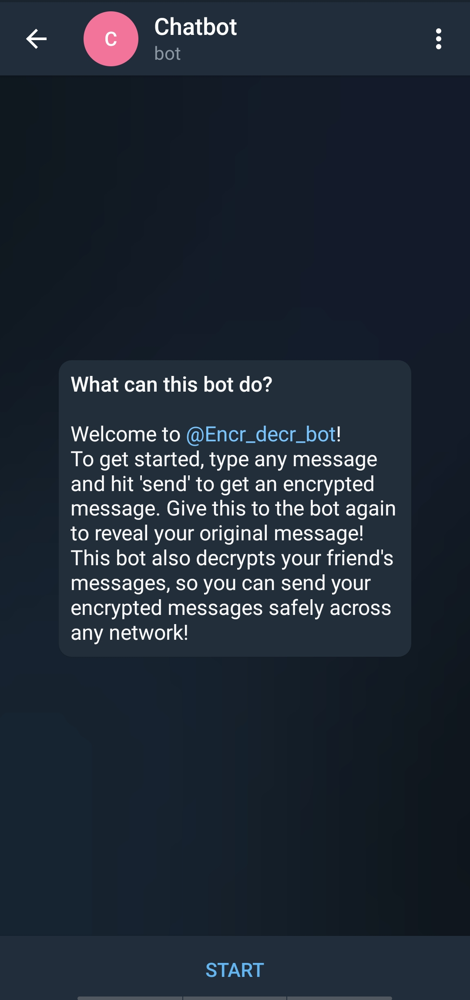
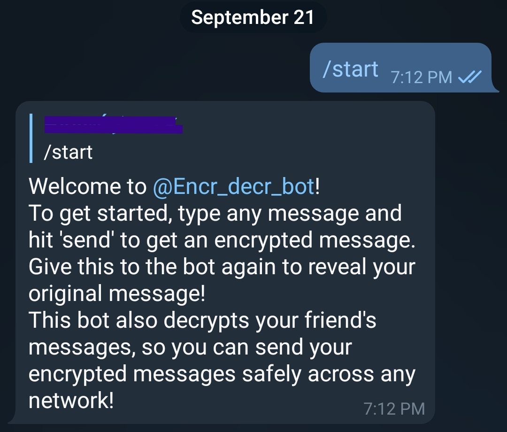
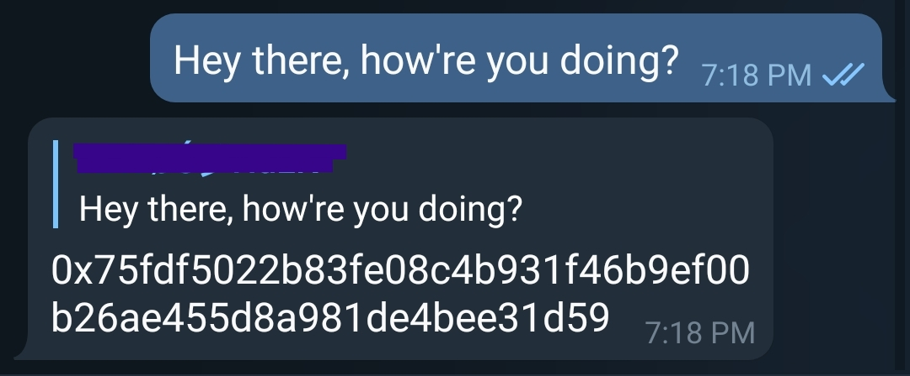
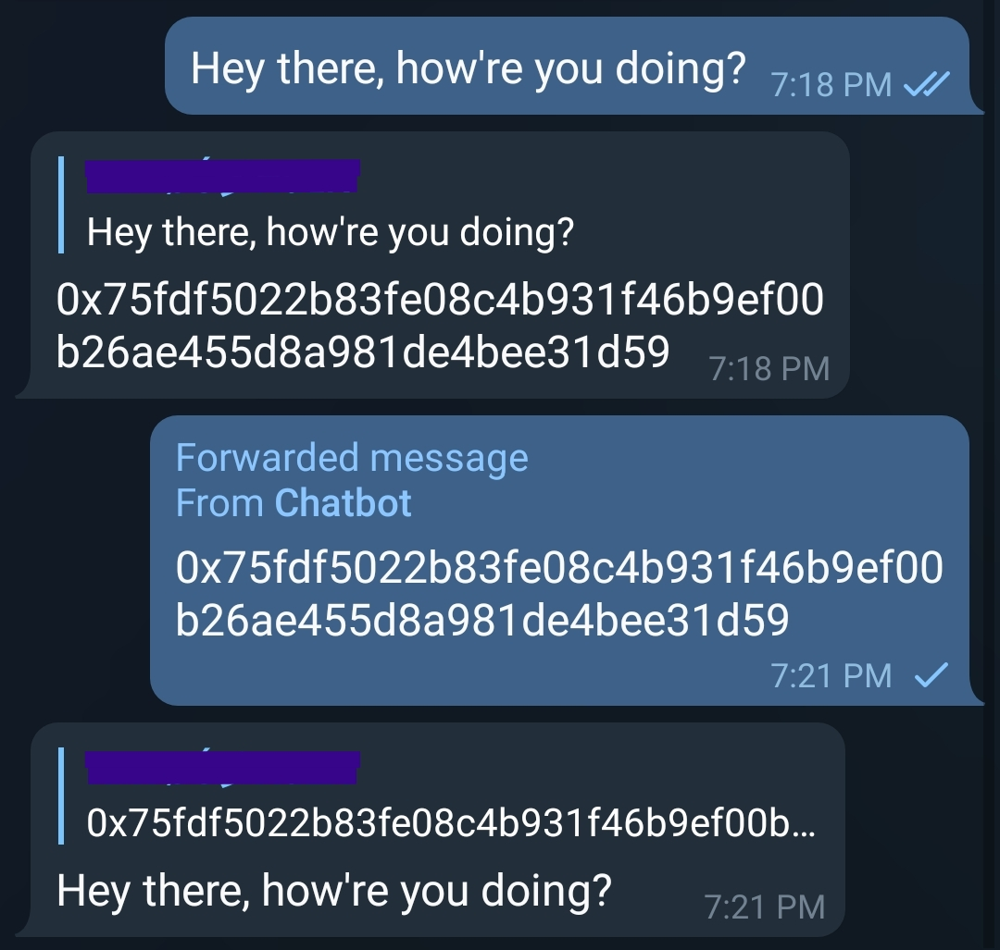

## 🔐 Encryption-Decryption Telegram Bot 🤖

<br/>

### About the project:
- A Telegram bot that encrypts and decrypts plain text messages using python which can then be safely sent across any network.

- This bot encrypts and decrypts messages using the [one-time-pad(OTP)](https://en.wikipedia.org/wiki/One-time_pad) logic.

- To get started, launch the [bot](https://t.me/Encr_decr_bot).

  - It will look something like this: 
  <br>
  

  <br>

  - Pressing the start button results in this:
  <br>
  
  
  <br>

  - Entering a plain text will give an encryped message for the same:
  <br>
  

  <br>

  - Forwarding or copy/pasting the encrypted message and giving it to the bot gives back the original message:
  <br>
  
  Congratulations! You were successful in encrypting and decrypting a message!
  
  <br>

  - The bot also replies to some commands like /greet and /hello:
  <br>
  
  
  <br>

  - Note that the bot supports only plain text, so if a document/audio/photo/sticker is given to it, it responds by saying:
  <br>
   

- ### Implementation using python:

  - In the file [keep_alive.py](https://replit.com/@crkshitij7/Encryption-Decryption-Telegram-Bot#keep_alive.py):

  ``` python

    from flask import Flask
    from threading import Thread

    app=Flask('')

    @app.route('/')

    def home():
            return "Alive"

    def run():
            app.run(host='0.0.0.0',port=8080)

    def keep_alive():
        t=Thread(target=run)
        t.start()

  ``` 
  This piece of code creates a server using flask and creates a thread which will be used by [main.py](https://replit.com/@crkshitij7/Encryption-Decryption-Telegram-Bot#main.py) to run indefinitely.
  
  - In the file [main.py](https://replit.com/@crkshitij7/Encryption-Decryption-Telegram-Bot#main.py), 
  ```python
    import telebot
    import random
    import os
    from keep_alive import keep_alive

    API_KEY= os.environ['API_KEY']
    s= int(os.environ['n'])
  ```
  Libraries telebot (from [pyTelegramAPI](https://github.com/eternnoir/pyTelegramBotAPI)), random, os are imported along with the [keep_alive.py](https://replit.com/@crkshitij7/Encryption-Decryption-Telegram-Bot#keep_alive.py) file. The bot API_KEY is hidden along with the seed from the general public (as anyone would be able to modify the bot).

  - The encryption and decryption are handled by the following code:
  ```python
    def encrypt(msg):
    st=""
    random.seed(s)
    for i in msg:
        key=random.randint(1,255)
        st=st+hex(ord(i)^key)[2:].zfill(2)
    return st

    def decrypt(msg):
    res=''
    random.seed(s)
    for i in range(0,len(msg),2):
        key=random.randint(1,255)
        res=res+chr(int(msg[i]+msg[i+1],16)^key)
    return res

    def send(msg):
    if(msg[:2]!='0x'):
        bi=encrypt(msg)
        return '0x'+bi
    else:
        bi=decrypt(msg[2:])
    return bi
  ```
  The encrypt method takes a plain text (ASCII string) as a parameter and performs the encryption according to the [one-time-pad](https://en.wikipedia.org/wiki/One-time_pad) logic.

  Similarily the decrypt method takes the encrypted message as parameter and converts it to the original message by following the same [one-time-pad](https://en.wikipedia.org/wiki/One-time_pad) logic.

  The send function takes the string given from the user to the bot as an input, and decides whether to call the encrypt method or decrypt method by looking at the first 2 letters of the string.

  - The bot object initialization and the keep_alive method are given by:

  ```python
    bot=telebot.TeleBot(API_KEY)
    keep_alive()
  ```

  - The commands to the bot and its responses are controlled by the following code:

  ```python
    @bot.message_handler(commands=['start'])
    def start(message):
        bot.reply_to(message,"Welcome to @Encr_decr_bot!\nTo get started, type any message and hit 'send' to get an encrypted message. Give this to the bot again to reveal your original message!\nThis bot also decrypts your friend's messages, so you can send your encrypted messages safely across any network!")

    @bot.message_handler(commands=['greet','Greet'])
    def greet(message):
        bot.reply_to(message,"Hey there!")

    @bot.message_handler(commands=['hello','Hello','Hey','hey'])
    def hello(message):
        bot.reply_to(message,"Hey, how are you?")
  ```

    - The rest of the code that takes in the string (plain text) from the user and responds to the message is:

    ```python
    @bot.message_handler(func=lambda m:True)
    def echo_all(message):	
        try:
        x=send(message.text)
        except:
        x='Currently only plain texts are supported, check back later for updates!'
        bot.reply_to(message,x)

    @bot.message_handler(func=lambda m:True ,content_types=['document','audio','sticker','photo'])
    def echo_(message):
        x='Currently only plain texts are supported, check back later for updates!'
        bot.reply_to(message,x)
        
    bot.polling()
    ```

    If the text given is a valid plain text, it successfully encrypts/decrypts (depending on what text you give it) and sends back the encrypted/decrypted message to the user. Otherwise any invalid text would return:  Currently only plain texts are supported, check back later for updates!

    The bot keeps on checking for any new messages by using the polling method.

- The server is kept alive by [uptimerobot](https://uptimerobot.com/), which periodically checks if the server is up or down, thus preventing it from sleeping, which otherwise would have shut down within the hour.